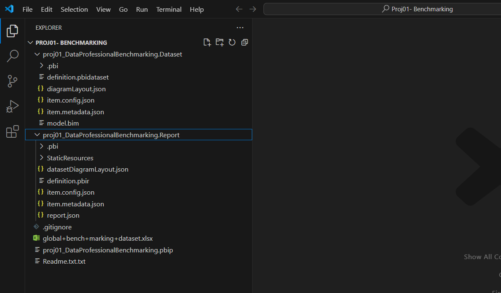
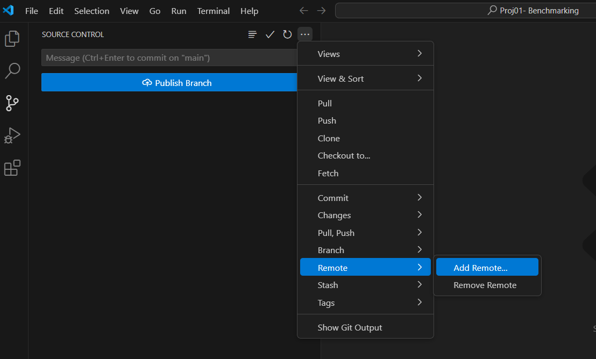
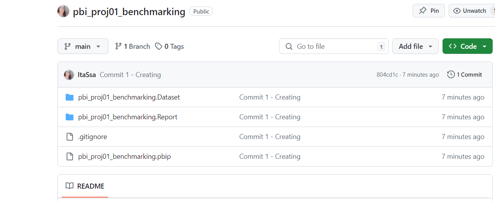
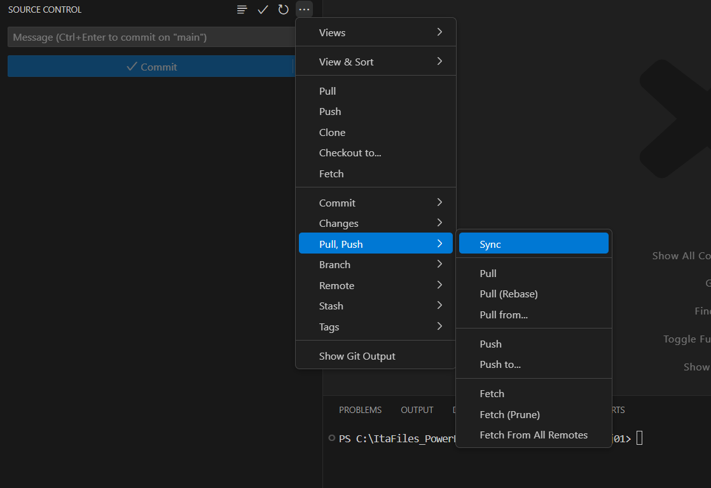
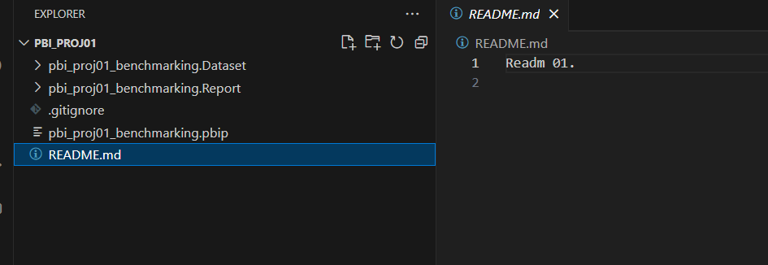

# <center>Source Control on Power BI</center>

1- Install Vscode on your windows. It can be downloaded from https://code.visualstudio.com/.
2- Install Git. It can be downloaded from https://git-scm.com/download/win .
3- After the Git installation go to Git CMD and than:
 3.1 - Set your user name:
 
 ```
  git config --global  user.name <your_git_user> 
 ```
 3.2 - Set your e-mail address:
 
 ```
  git config --global  user.email <your_git_email> 
 ```
 4 - On Power BI, go to Options and Settings > Options > Preview Features and enable 'Power BI Project (.pbip) save option'.

 5- Open/create your power BI file and save as 'Power BI projects Files (*.pbip)'.
   It is a good practice to create a new folder content for this new power BI project.
   After that, notice that will be created two aditional  folders Dataset and Report.

 6- Open your power bi project file folder on VsCode.
      Notice the sub-folders structure on VSCode:
      

 7- On VsCode go to Source Control and choose 'Initialize Repository', include a comment and click on 'Commit'.

 8- Create a new repository on your github and copy the url.
 
 9- On Source Control menu, go to Remote and hit 'Add Remote', now you can add your Github Repository url.

 
 
 10- After that hit "Publish Branch".
 11- Switch to Github and than you can the code in the main branch.
  
 12- Now you can, for example, create a Readme file on your github repositoy and backing to VsCode hit in "Sync",this action will pull and push commits from and to your main branh.
 
 
 13- After that you can notice your Readme file in your local folder
  

 Now you can change your power BI project and use git normally. ;)

